# Project K Advent Klendr

What would you do when you don't have enough time to write code for a project before Dec. 1st?
Create an NFT that will provide VIP access to the project once ready.

See the [Project K collection in Portion on the Palm network](https://portion.io/nft-marketplace?category=&collection=&artist=ProjectK&chains=Palm&sortBy=newest).

Day 1 is the first of the Advent Klendr project pre NFT.
There will be 24 of them as the 24 days before christmas.

Each Klendr NFT will give you exclusive access to the next Project K NFT collection.

Supply of each Klendr NFT is the invert of the number of remaining days.

`Supply = 24 - (day number - 1)`

Day 1: December 1st -> supply is 24.
Day 2: December 2nd -> supply is 23.
Day 3: December 3rd -> supply is 22.
...
Day 24: December 24th -> supply is 1.

You get it?
IT LOOKS LIKE A TREE!!! You get it? A f****** christmas tree!!!

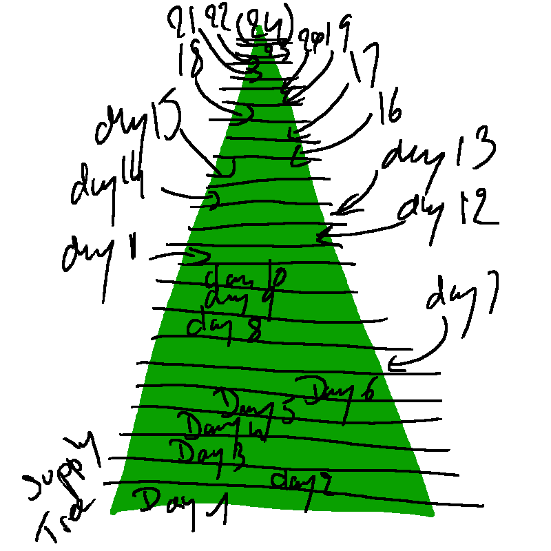

The price is also linked to the supply of course.
`Price of each NFT = Price of the 24th NFT / the current NFT supply`

## Buy the NFTs on [Portion](https://portion.io/nft-marketplace?category=&collection=&artist=ProjectK&chains=Palm&sortBy=newest)

| [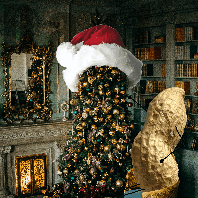](https://portion.io/app.html#exchange?ID=QmYwxXgaoWigHypN6oHxUGuUWBSyTohEGhywcBZ9tDhvu2&chainID=11297108109) |  | [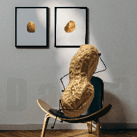](https://portion.io/app.html#exchange?ID=Qmb5b6iXnQcCp9x3XH1sZ7MsG5wjSHi4g4wzJRxvwnhyuR&chainID=11297108109) | [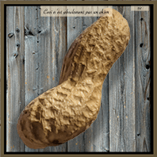](https://portion.io/app.html#exchange?ID=QmfCamLJ8ntwbvh3gNX8q9yPkLJRQV877S7erDCs5MFSKL&chainID=11297108109) | [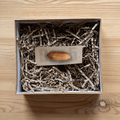](https://portion.io/app.html#exchange?ID=QmdnA19C9ugL1VHvXCyS6o6MFxUqSSyxKw6qcdGUhGXgnT&chainID=11297108109)  |   |
|----|----|----|----|----|----|
|  | [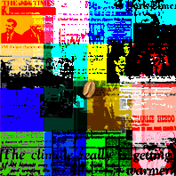](https://portion.io/app.html#exchange?ID=QmXd7WQdd9AR9jc1DRfQBgxmEgNXfGWX2xEZ9Ru3zRnCGz&chainID=11297108109)  | [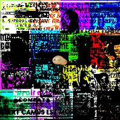](https://portion.io/app.html#exchange?ID=QmWKK41HPkJcofUVHwfih4L6ASACsYUdSbgFHkvWXnpGq7&chainID=11297108109)  |  | [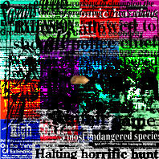](https://portion.io/app.html#exchange?ID=QmRXFtfzZBq5aXAebt22xgDZoY3rP4JG5HEaMwcPftohR5&chainID=11297108109) | [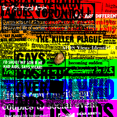](https://portion.io/app.html#exchange?ID=QmNi1wWB2rzVRBjsokv8nxYTPRj2BngLGi3nfaSyV7Tvg1&chainID=11297108109) |
| 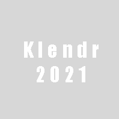 |  |  |  |  |  |
|  |  |  |  |  |  |

## Supplies and prices

| Day | Supply | Price (WETH)       |
|-----|--------|--------------------|
| 1   | 24     | 0.0416666666666667 |
| 2   | 23     | 0.0434782608695652 |
| 3   | 22     | 0.0454545454545455 |
| 4   | 21     | 0.0476190476190476 |
| 5   | 20     | 0.0500000000000000 |
| 6   | 19     | 0.0526315789473684 |
| 7   | 18     | 0.0555555555555556 |
| 8   | 17     | 0.0588235294117647 |
| 9   | 16     | 0.0625000000000000 |
| 10  | 15     | 0.0666666666666667 |
| 11  | 14     | 0.0714285714285714 |
| 12  | 13     | 0.0769230769230769 |
| 13  | 12     | 0.0833333333333333 |
| 14  | 11     | 0.0909090909090909 |
| 15  | 10     | 0.1000000000000000 |
| 16  | 9      | 0.1111111111111110 |
| 17  | 8      | 0.1250000000000000 |
| 18  | 7      | 0.1428571428571430 |
| 19  | 6      | 0.1666666666666670 |
| 20  | 5      | 0.2000000000000000 |
| 21  | 4      | 0.2500000000000000 |
| 22  | 3      | 0.3333333333333330 |
| 23  | 2      | 0.5000000000000000 |
| 24  | 1      | 1.0000000000000000 |

## Questions no one asked but we will still answer...

### Do you give some?

Yes, some are given to 5 randomly selected Twitter followers at the end of of
each Klendr row. Four giveaways.

[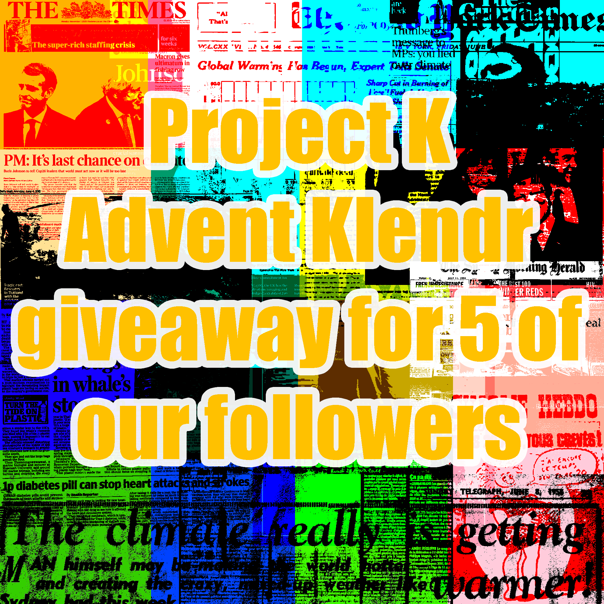](https://twitter.com/KProjectOffical)

### How do I know if I won?

This is announced on our Twitter account.

### What if I buy one of each day?

First thanks and congrats! You are the best degen and we love you a lot! Really!
Then, you will have the best prime access the the Project K 24 days project to come and a lot of VIP shit for all our future projects.

### What if I don't have the 24 NFTs?

Don't worry, you will have a very prime access too. Not as good as if you had all 24 nFTs, but still, we love you a lot so you can count on things like airdrops and other stuff ...

### Do I have to buy all supply of each day to improve my prime access?

No, absolutely not. For example, having one Day 1 NFT or 24 is the same.
If you want to buy all the 24, feel free to do it, but it will only make you look like an egoistic person as no one else will be able to have any.
This is not welcome on christmas. Be nice.

### Have you been stealing these background pictures?

Ah Ah, no. But you are right, it deserves credit:

- [cottonbro from Pexels](https://www.pexels.com/@cottonbro)
- [Andrea Piacquadio from Pexels](https://www.pexels.com/@olly)
- [Monstera from Pexels](https://www.pexels.com/@gabby-k)
- [Mati Mango from Pexels](https://www.pexels.com/@mati)

### Why don't you have a nice designed website?

Isn't this nice? I prefer to spend time on NFTs creating surprising things than on a website no one reads.

---

Advent Klendr is part of the Project K. Read project manifest on https://kprojectoffical.github.io/project-k-manifesto/

---

Find Project K on:

- [Twitter](https://twitter.com/KProjectOffical)
- [Portion](https://portion.io/nft-marketplace?category=digital&collection=&artist=ProjectK&chains=Palm&sortBy=newest) on [Palm network](https://palm.io/)

---

<a property="dct:title" rel="cc:attributionURL" href="https://kprojectoffical.github.io/">Project K site</a> by <a rel="cc:attributionURL dct:creator" property="cc:attributionName" href="https://github.com/KProjectOffical/">Project K</a> is licensed under <a href="http://creativecommons.org/licenses/by-nc-sa/4.0/?ref=chooser-v1" target="_blank" rel="license noopener noreferrer" style="display:inline-block;">CC BY-NC-SA 4.0</a>

